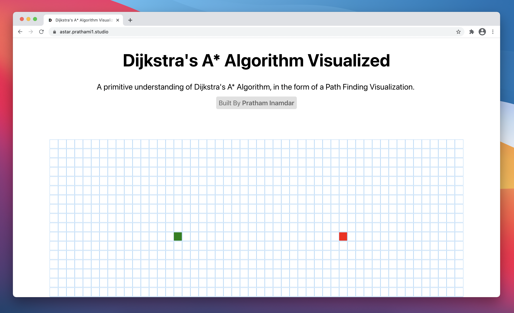
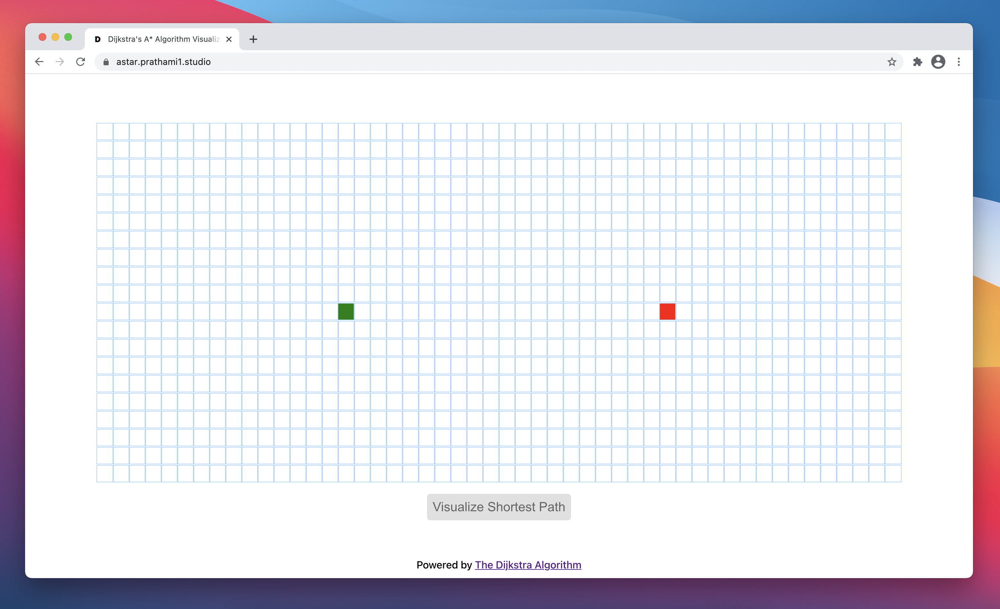
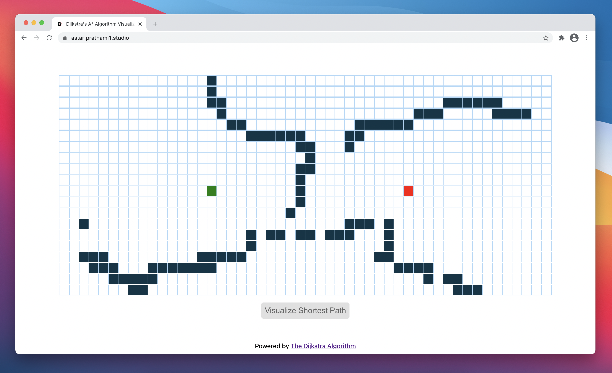
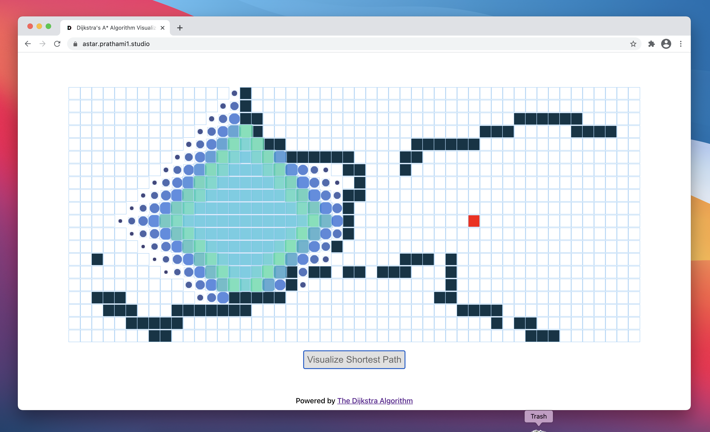
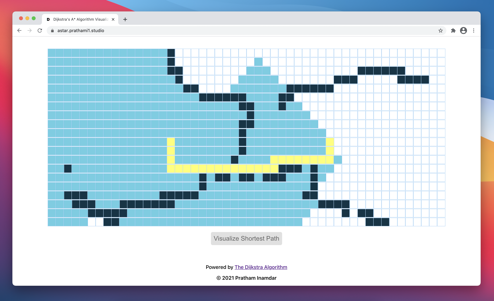

# Dijkstra's A* Algorithm Visualized
A primitive understanding of Dijkstra's A* Algorithm, in the form of a Path Finding Visualization. In an earlier repository, I visualized a path finding algorithm in the form of a pygame window, with a python script (which can be found [here](https://github.com/prathami1/py-visualization)). In order to view the visualization in a web format, I created a React Web Application that showcases the algorithm, with fancier animations. 

## How it works
Attached below are pictures of the website, with instructions and a detailed outline of the web app's functionality to go with it. 

#### Below is a picture of the game board, with the starting and ending nodes of the path.

#### Below is a picture of a sample obstacle course submitted by the user through mouse input, before the alogrithm start's its process.

#### Below is a picture of the algorithm in action, calculating the shortest path for the two nodes to connect.

#### Finally, here is an image of the final product, the shortest path between the two nodes

## Dependencies Utilized
- React (JSX)
- Javascript (for the algorithmic backend)
- Dijkstra's alogrithm 
